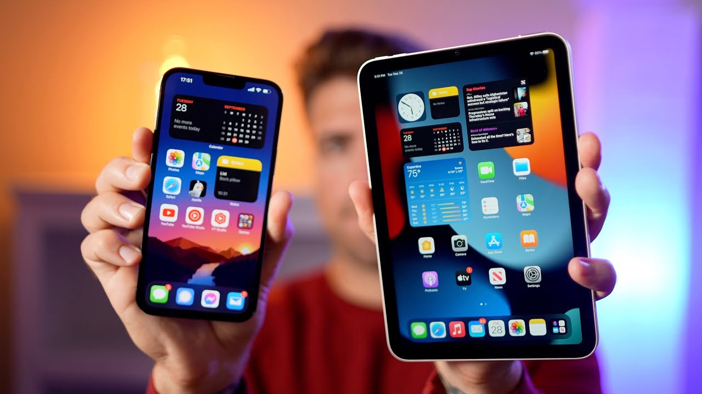

# Introduction to Computer Systems
### What is a Set?
A `set` is a collection of elements.

  

### What is a system?
A `system` is a **goal-oriented** organized set including some related elements. each element has an impact on the main goal.

Solar system             |  Nervous system
:-------------------------:|:-------------------------:
  |  

<!--

   Solar System

   Nervous System

-->

## What is a computer system?
A system with some `hardware` and `software` elements capable of doing computational tasks. for example *PCs, Laptops, Smartphones, Smartwatches, Smart TVs, Video Game Consoles, Robot Vacuums, Smart Light Bulbs, Smart Washers and Dryers, Self-driving Cars, Engineering Calculators, Satellites, etc*.
### Different types of computer systems
- **Supercomputer:** A computer with a high level of performance used for scientific and engineering problems such as *weather forecasting, aerodynamic research, probabilistic analysis, radiation shielding modeling, brute force code breaking, 3D nuclear test simulations, molecular dynamics simulation, etc*.
  The performance of a supercomputer is commonly measured in floating-point operations per second (`FLOPS`) instead of million instructions per second (`MIPS`).
 

   The IBM Blue Gene/P supercomputer

- **Server:** A server is a centralized storage place for programs, data, and information that controls access to the hardware, software, and other resources on a network.

   HPE ProLiant DL380 Gen10 server

- **PC (Personal Computer) / Mac (Macintosh):** Workstations for regular users. There are two types: `Desktop` and `Laptop`.

   Apple Mac Studio

   Apple MacBook Pro 14 2023

- **Mobile computers (Tablet, Smartphone):** A computer that is expected to be transported during normal usage and allow for the transmission of data, which can include voice and video transmissions.

   Apple iPhone and Apple iPad

- **Wearable computers (Smartwatch, Smartglasses):** A computing device worn on the body.
- 

   Apple Watch SE

- **Microcontroller (MCU):** A small computer on a single VLSI integrated circuit (IC) chip designed for embedded applications such as *automobile engine control systems, implantable medical devices, remote controls, office machines, appliances, power tools, toys, etc*.

   AVR microcontrollers: ATmega8, ATxmega128A1, ATtiny45

## The architecture of a computer system
One of the most common architectures is the `von Neumann (stored-program)` architecture. Based on this architecture, a computer system is composed of 3 different units, `CPU`, `MU`, and `IOU`. 

   The von Neumann (stored-program) architecture and auxiliary devices

- **CPU (Central Processing Unit):** The elements of the system that are responsible for `arithmetic`, `logic`, and `control` operations. `Microprocessors` play the role of the `CPU` in most computer systems. Different processors have different `instruction sets` known as `machine language`.
- **MU (Memory Unit):** The `instructions` and `data` that are executed by the CPU should first be loaded into a **fast** and **temporary** main memory known as the Memory Unit (Main Memory). `RAM` modules play the role of the `MU` in most computer systems. This is just a temporary memory for the CPU to access the data and run the programs. The data in this memory will be lost after electrical power loss.
- **IOU (Input/Output Unit):** We need a lot of external devices connecting to a computer system. A keyboard, a mouse, or a touchscreen input data to the system, and a monitor or a printer output the data from the system. We also need `Auxiliary Memory` devices like `Hard Disk Drives` or `USB Flash Drives` to keep the data permanently. All the elements that let us connect external devices to a computer system are categorized under the IOU. For example, a `Graphics Adapter` is an IOU device connecting the monitor to the system, and a `Network Interface Controller` is an IOU device letting us connect other computer systems to the system and make a `computer network`.

